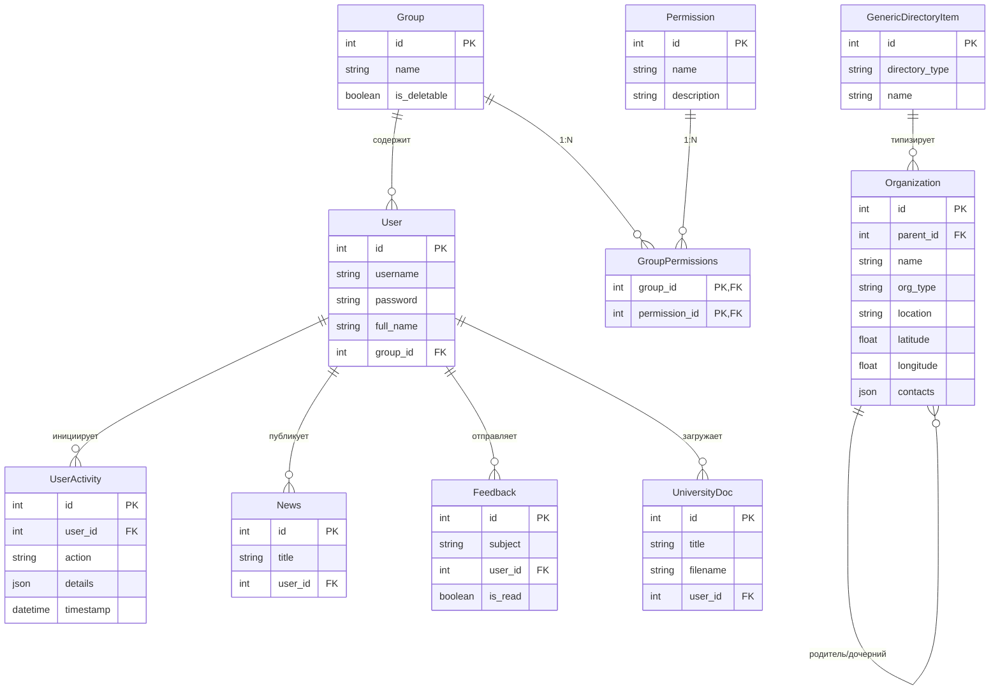

# Разработка Информационно-справочной системы в формате интерактивной карты на базе OpenStreetMap 

## 1. Аннотация проекта
Данная работа представляет собой прототип корпоративной информационной системы (КИС), предназначенной для централизации данных об имущественном комплексе и штатной структуре университета. Основная научная ценность заключается в реализации иерархической модели данных для описания сложных организационных структур и интеграции инструментов геоинформационного анализа.

---

## 2. Архитектура базы данных (ER-диаграмма)
Проектирование базы данных выполнено с соблюдением требований к реляционной нормализации. Ниже представлена схема связей, включающая подсистему разграничения прав доступа (RBAC) и иерархию организаций.

---
## 3. Ключевые модули системы

### 3.1. Модуль генерации отчетности
В ответ на требования к прозрачности интерфейса, функционал экспорта данных интегрирован в систему по принципу повсеместной доступности:
*   **Глобальный экспорт:** Доступен через главное меню навигации и карточку "Отчеты" на Dashboard.
*   **Контекстный экспорт:** Выгрузка данных возможна напрямую из дерева реестра (форматы `.xlsx` и `.docx`).
*   **Объектный экспорт:** Формирование подробного паспорта подразделения в формате MS Word из карточки просмотра организации.

### 3.2. Управление иерархическим реестром
Реализован интерфейс «дерева», позволяющий визуализировать подчиненность кафедр факультетам, а факультетов — головному вузу или филиалам. 
*   **Улучшенная эргономика:** Кнопка «Добавить новую организацию» выделена как основной призыв к действию (CTA), обеспечивая быстрый доступ к административным функциям.

### 3.3. Модуль управления файловой системой
Система предоставляет специализированный интерфейс для прямого доступа к серверному хранилищу (`static/uploads`).
*   **Назначение:** Контроль за целостностью загруженных официальных документов, фотографий и планов зданий.
*   **Безопасность:** Доступ к файловому менеджеру регулируется отдельным правом доступа `view_files`, что исключает несанкционированный просмотр структуры папок рядовыми пользователями.

### 3.4. Интерактивная картография
Визуализация объектов на карте с использованием Leaflet.js и автоматическим геокодированием адресов через Yandex API.

---

## 4. Обоснование хранения базы данных в репозитории
**Требование:** Файлы базы данных (`app.db`) размещены непосредственно в git-репозитории.

**Академическое обоснование:** 
Данный подход выбран для обеспечения **воспроизводимости исследования**. Включение предзаполненной базы данных SQLite в репозиторий позволяет:
1.  Предоставить аттестационной комиссии среду, уже наполненную репрезентативными данными (реальная структура МУИВ).
2.  Гарантировать корректную работу всех модулей (отчетов, карт, логов) без необходимости прохождения этапа ручного ввода данных.
3.  Обеспечить неизменность тестового контура при переносе проекта между рабочими станциями.

---

## 5. Технологический стек
*   **Язык:** Python 3.13
*   **Framework:** Flask (архитектура Blueprints)
*   **ORM:** SQLAlchemy
*   **Reporting:** `python-docx` (генерация Word-отчетов), `openpyxl` (генерация Excel-таблиц)
*   **Frontend:** Bootstrap 5, Leaflet JS, FontAwesome 6

---

## 6. Инструкция по развертыванию
1. Клонировать репозиторий.
2. Установить зависимости: `pip install -r requirements.txt`.
3. Создать администратора: `flask create-admin`.
4. Синхронизировать права доступа (при необходимости обновления структуры): `flask seed-permissions`.
5. Запустить приложение: `python run.py` (или через `flask run`).